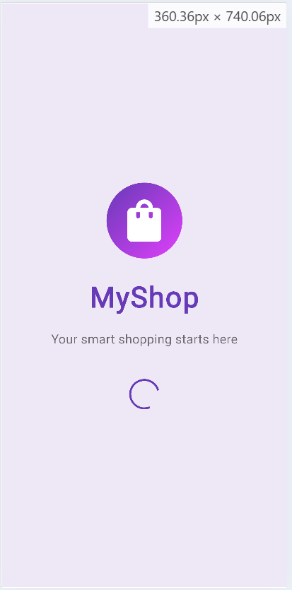
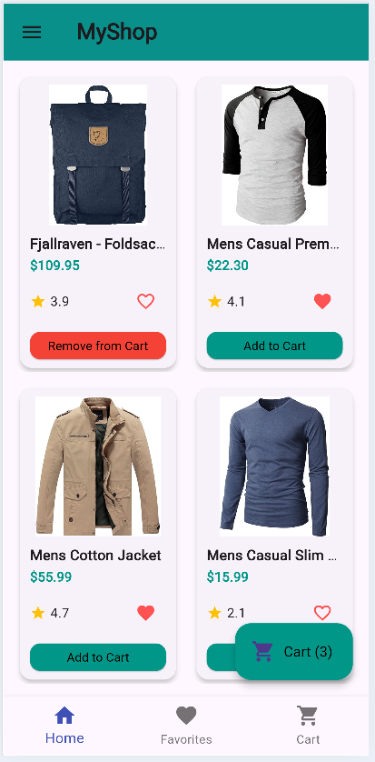
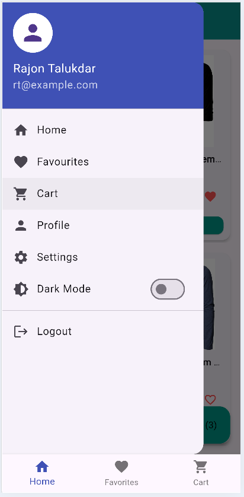
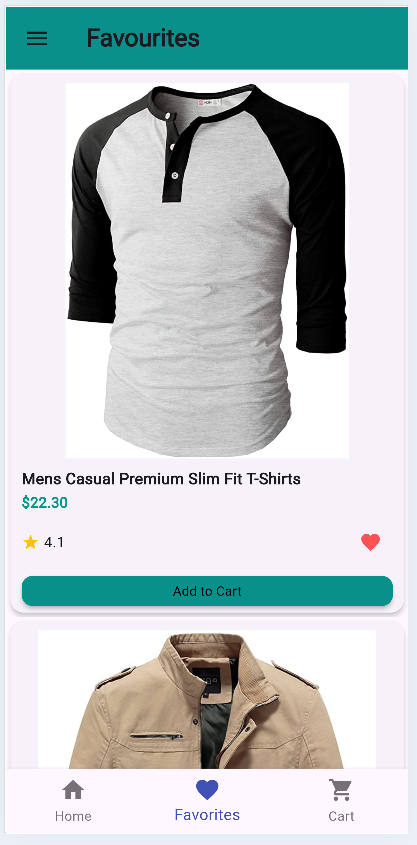
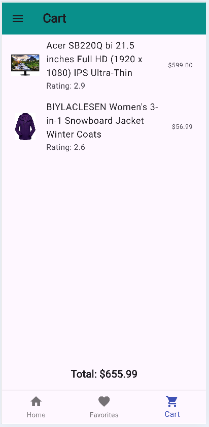
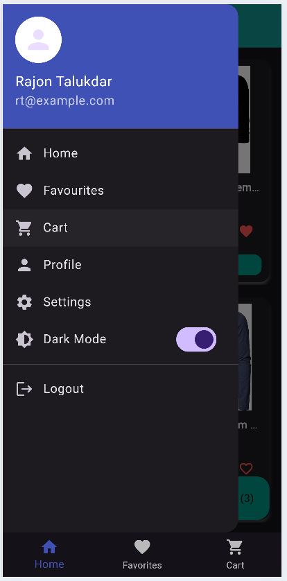
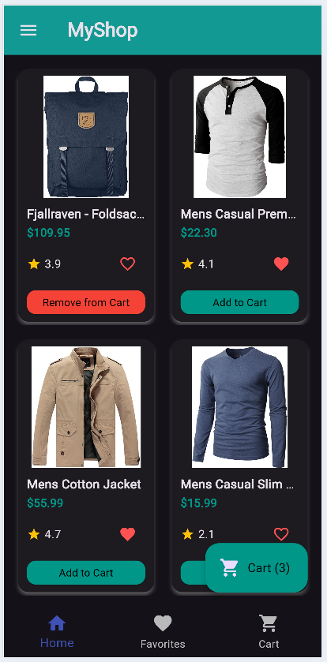
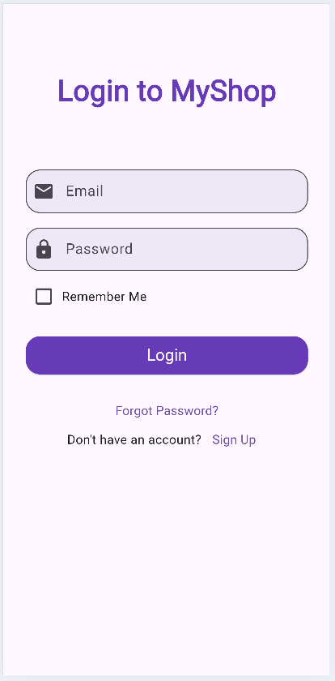
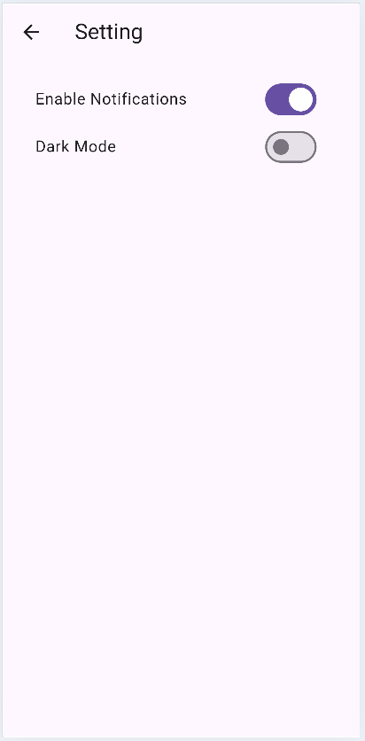
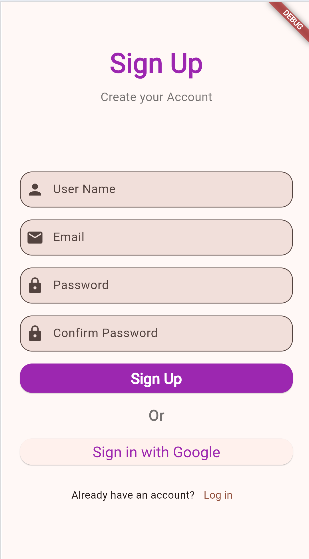

# 🛍️ MyShop – Flutter E-Commerce App

**MyShop** is a sleek and responsive e-commerce Flutter application that demonstrates modern Flutter development practices. It uses the **FakeStore API** for product data, **Provider** for state management, **SharedPreferences** for persistence, and supports **dark/light theme switching**.

<br>

## ✨ Features

- 🛒 **Home Page with Product List**  
  Real-time product fetching using the FakeStore API, displayed with stylish product cards.

- ❤️ **Favorites**  
  Mark/unmark products as favorites and persist them across sessions.

- 🛍️ **Cart with Badge Counter**  
  Add/remove items to cart with real-time cart total and badge display.

- 🌙 **Light/Dark Theme Toggle**  
  User-friendly UI that supports theme switching and saves the preference locally.

- 📱 **Responsive UI**  
  Works well across different screen sizes.

- 🔐 **Login/Register (Mock UI)**  
  Placeholder screens for future authentication.

- 📦 **Persistent Cart & Favorites**  
  Saved locally using SharedPreferences.

<br>

## 📸 Screenshots

| Splash Screen | Home Page | Drawer |
|---|---|---|
|  |  |  |

| Favorites | Cart | Theme Toggle |
|---|---|---|
|  |  |  |

| Darkmode | Login | Setting |
|---|---|---|
|  |  |  |

| Signup |
|---|
|  |

> 📁 Make sure to place your images in the `screenshots/` folder inside your repo.

<br>

## 🧠 Tech Stack

- **Flutter**
- **Provider** – State Management
- **SharedPreferences** – Local Persistence
- **FakeStore API** – Product Data
- **Material 3** – UI
- **Dart**

<br>

## 🚀 Getting Started

1. **Clone the repo**
   ```bash
   git clone https://github.com/rtrajon-dev/Smart-Myshop.git
   cd myshop
